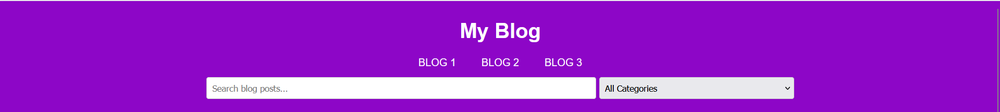
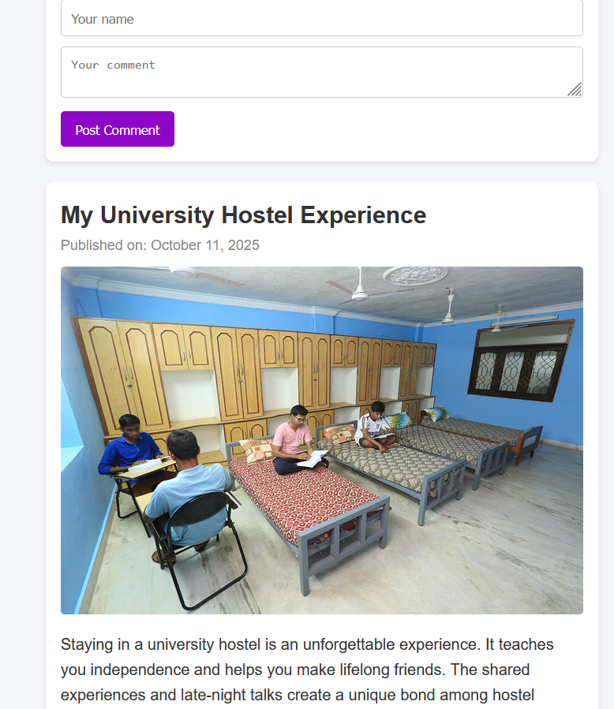
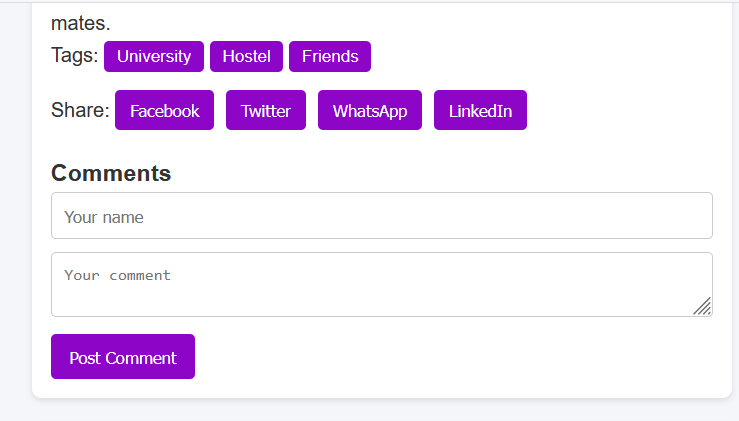

#  My Blog Website

A clean, responsive, and easy-to-use **Blog Website** built using **HTML, CSS, and JavaScript**.  

Users can explore blog posts, search content, filter by categories, 

post comments, and share blogs on social media platforms.

![Website Preview]
----------
Screen sorts: 

------Header section ------>



!------[Main section] ------







------Footer section--------


---

##  Features

###  Blog Posts

- Displays multiple blogs with images, titles, dates, and detailed content.  

- Each blog includes **categories/tags** for better navigation.

###  Search Bar

- Real-time filtering of blog posts as the user types.  

- Instantly finds matching content by keyword or title.

###  Categories / Tags
- Filter blogs by category such as **Village Life**, **University**, or **Festival**.  

- Organized and easy for readers to browse.

###  Comment System
- Visitors can add comments under each post.  

- Comments appear instantly (no page reload).

###  Social Media Sharing
- One-click share buttons for:

  - Facebook  

  - Twitter / X  

  - WhatsApp  

  - LinkedIn  

###  Responsive Layout
- Works smoothly on mobile, tablet, and desktop screens.

---

##  Tech Stack

| Technology | Purpose |

|-------------|----------|

| **HTML5** | Structure and content |

| **CSS3** | Styling and responsiveness |

| **JavaScript (ES6)** | Interactivity and functionality |

---

##  Folder Structure

```
blog-website/
│

├── index.html          # Main HTML file

├── css/

│   └── styles.css      # CSS styles

├── js/

│   └── script.js       # JavaScript functionality

├── images/

│   ├── image.png       # Village life image

│   ├── image1.png      # University hostel image

│   └── image2.png      # Festival image

└── README.md           # Project documentation

```


---

##  How to Run Locally

1. **Clone or Download** this repository:
   ```bash

   git clone https://github.com/Nitesh-Pandit/Blog-website

Open the folder in Visual Studio Code.

Launch the project:

Right-click index.html → “Open with Live Server”

or simply open it in any web browser.

 ##--------Learning Outcomes---------

Structuring multi-post blogs using HTML

Styling responsive layouts with CSS

Adding interactivity via DOM manipulation in JavaScript

Implementing real-time search and category filters

Creating social-share links dynamically

--------Future Enhancements-------

 Admin dashboard to add/edit/delete posts

 Store comments using localStorage or a database

 Add “Like” or “Reaction” counters

 Add Dark/Light mode toggle (optional feature)


 ##### Author

--------Nitesh pandit-----------

📅 Project Year: 2025
💼 Project: Blog Website using HTML, CSS & JavaScript

